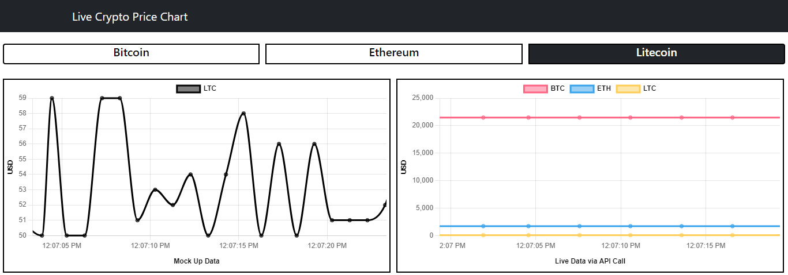

# LIVE CRYPTO PRICE CHART

This project will display Live Crypto Price Chart for Bitcoin, Ethereum and Litecoin. This project uses React JS and Chart.js Javascript libraries with the help of chartjs-plugin-streaming plugin to display and plot data on the charts in realtime. The data populated on the charts is partly pulled from Coin Gecko public API.

Hosted on AWS Amplify: https://main.dysj64nwuditb.amplifyapp.com/

